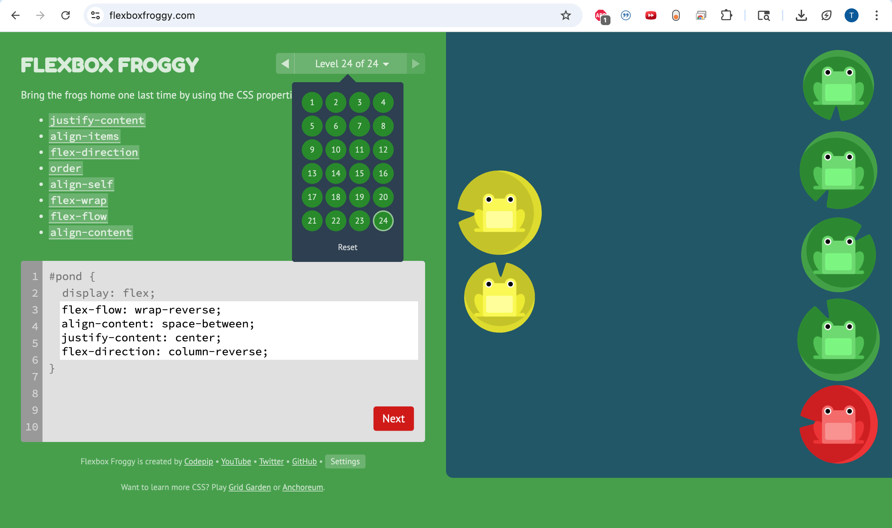
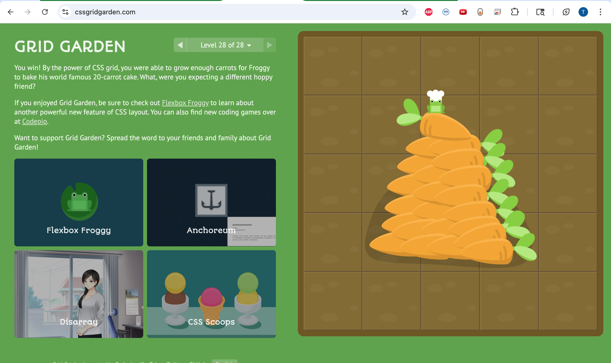

SURVEY COMPLETED

Grid puts everything on a grid system where you control the amount of rows and columns. I think this is my personal favorite, since it makes more sense to me conceptually. Flexbox is more about directions and is better for child elements.
